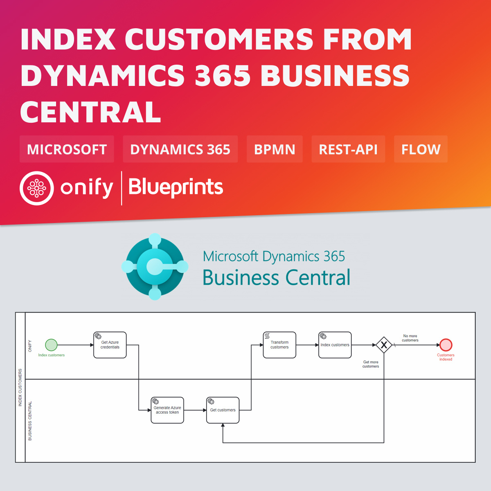

[](https://www.repostatus.org/#wip)


# Onify Blueprint: Index customers from Dynamics 365 Business Central

[Dynamics 365 Business Central](https://dynamics.microsoft.com/business-central/overview/) (formerly called Dynamics NAV) is a powerful and complete business system from Microsoft with a focus on small and medium-sized business processes. 

In this Blueprint we show how to index all customers (from a specific company).



## Requirements

* [Onify Hub](https://github.com/onify/install)
* [Camunda Modeler](https://camunda.com/download/modeler/)
* [Dynamics 365 Business Central](https://dynamics.microsoft.com/business-central/overview/)

## Included

* 1 x Flow

## Setup

### Microsoft Azure

1. Register the external application in Azure Active Directory
2. Create the external application account in Business Central
3. Grant consent

> See detailed instructions here: https://www.kauffmann.nl/2021/07/06/service-to-service-authentication-in-business-central-18-3-how-to-set-up/

> See also: https://learn.microsoft.com/en-us/dynamics365/business-central/dev-itpro/administration/automation-apis-using-s2s-authentication

### Onify

Add the following setting(s) to Onify.

_Replace `<TENANT>`, `<CLIENTID>` and `<CLIENTSECRET>` with correct values._

```json
{
  "key": "_azure_credentials",
  "name": "Microsoft Azure credentials",
  "value": "{\"tenant\":\"<TENANTID>\", \"client_id\":\"<CLIENTID>\", \"client_secret\":\"<CLIENTSECRET>\"}",
  "type": "object",
  "tag": [
    "azure",
    "credentials",
    "frontend"
  ],
  "category": "custom",
  "role": [
    "admin"
  ]
}
```

## Test

1. Open the BPMN diagram in Camunda Modeler.
2. Update `headers.Prefer.odata.maxpagesize` (Get customers task) to preferred value (optional)
3. Update company id in `url` script (Get customers task)
4. Deploy the BPMN diagram (click `Deploy current diagram` and follow the steps).
5. Run it (click `Start current diagram`).

## Support

* Community/forum: https://support.onify.co/discuss
* Documentation: https://support.onify.co/docs
* Support and SLA: https://support.onify.co/docs/get-support

## License

This project is licensed under the MIT License - see the [LICENSE](LICENSE) file for details.